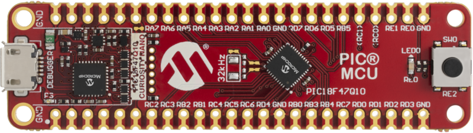

 <article class="markdown-body entry-content p-3 p-md-6" itemprop="This needs to locked down and 'never' changed">

# PIC18F47Q10 Receiving Data as a Slave SPI Device
In this demo, the SPI will be configured as slave and it will be used to receive data from a master device.

## Related Documentation
- [PIC18F-Q10 Family Product Page](https://www.microchip.com/design-centers/8-bit/pic-mcus/device-selection/pic18f-q10-product-family)
- [PIC18F47Q10 Data Sheet](http://ww1.microchip.com/downloads/en/DeviceDoc/40002043D.pdf)

## Software Used
- MPLAB® X IDE 5.30 or newer [(microchip.com/mplab/mplab-x-ide)](http://www.microchip.com/mplab/mplab-x-ide)
- MPLAB® XC8 2.10 or a newer compiler [(microchip.com/mplab/compilers)](http://www.microchip.com/mplab/compilers)
- MPLAB® Code Configurator (MCC) 3.95.0 or newer [(microchip.com/mplab/mplab-code-configurator)](https://www.microchip.com/mplab/mplab-code-configurator)
- MPLAB® Code Configurator (MCC) Device Libraries PIC10 / PIC12 / PIC16 / PIC18 MCUs [(microchip.com/mplab/mplab-code-configurator)](https://www.microchip.com/mplab/mplab-code-configurator)
- Microchip PIC18F-Q Series Device Support (1.4.109) or newer [(packs.download.microchip.com/)](https://packs.download.microchip.com/)

## Hardware Used
- PIC18F47Q10 Curiosity Nano [(DM182029)](https://www.microchip.com/Developmenttools/ProductDetails/DM182029)

## Setup
The PIC18F47Q10 Curiosity Nano Development Board is used as the test platform.

The following configurations must be made for this project:

|Pin           | Configuration      |
| :----------: | :----------------: |
|RA5 (SS)      | Digital Input      |
|RC3 (SCK)     | Digital Input      |
|RC4 (SDI)     | Digital Input      |
|RC5 (SDO)     | Digital Output     |

## Operation
Run the code, connect an oscilloscope or logic analyzer to the pins. In order to see the results, a master SPI device must be connected with the slave device. The data will be received on slave's SDI pin and will be stored in `receiveData`.

